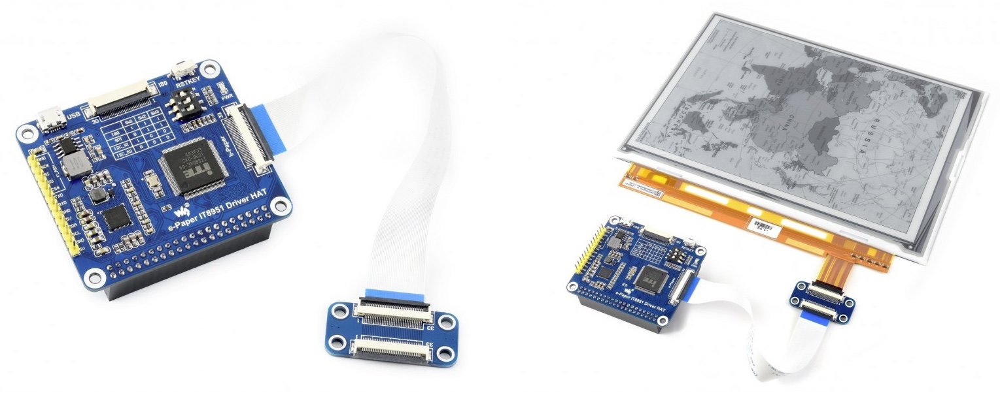

# Rust-IT8951
Rust-based driver for the Waveshare IT8951 e-Paper board.

## Introduction 

This library can be used in three different ways:
- The library can be run on a Raspberry Pi to interface with a connected IT8951 board via SPI
- The library can be run on a PC to connect to a IT8951 via a [Bus Pirate](https://www.sparkfun.com/products/12942) using SPI
- The library emulates the IT8951 hardware so that the higher-level operations can be debugged and tested without an actual IT8951 board

The library is designed so that only the low-level GPIO and SPI code is platform-specific. All code above the level of SPI is the same for the three use cases. This makes the emulator or Bus Pirate mode a good way of testing and debugging your application, with the guarantee that it will most likely also work on a Raspberry Pi. 

See [buspirate_it8951.md](buspirate_it8951.md) for a guide on how to use a Bus Pirate with the Waveshare IT8951 board.

 
Image source: [https://www.waveshare.com/9.7inch-e-paper-hat.htm](https://www.waveshare.com/9.7inch-e-paper-hat.htm)

## Related Resources

- https://www.waveshare.com/wiki/9.7inch_e-Paper_HAT
- https://www.waveshare.com/w/upload/1/18/IT8951_D_V0.2.4.3_20170728.pdf
- https://github.com/joukos/PaperTTY
- https://github.com/waveshare/IT8951
- https://github.com/ZinggJM/GxEPD2
- https://github.com/naluhh/IT8951
