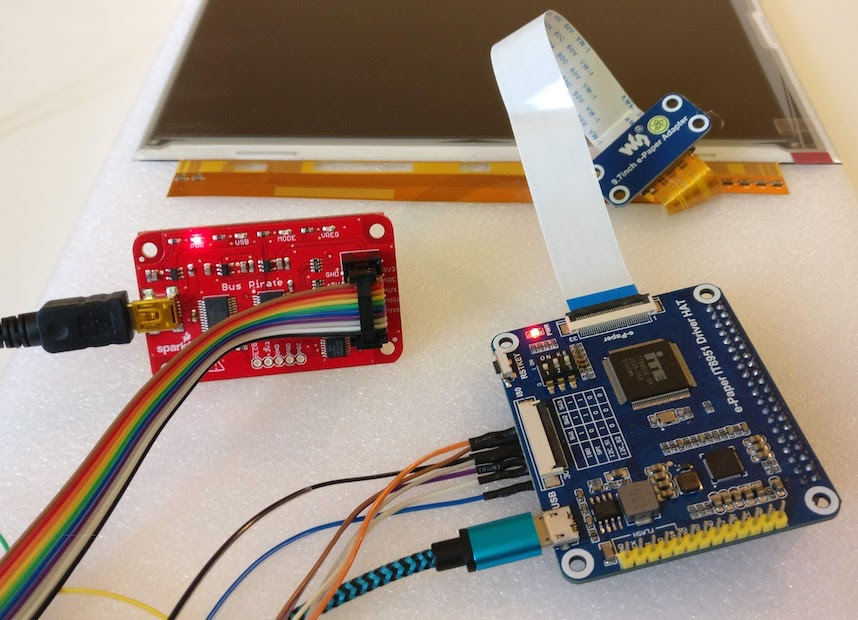
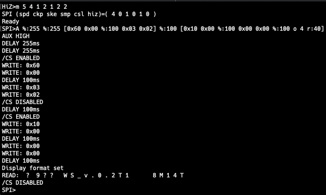

# Connecting to the Waveshare IT8951 board with a Bus Pirate (SPI mode)

For easier development I wanted to connect the Waveshare IT8951 board directly to my computer instead of having to test/debug via a Raspberry Pi. I am aware that the board has a USB interface, but the goal was to run, test and debug the same SPI code that would be running on Raspberry Pi and Arduino later on. My solution was to use a Bus Pirate as a "USB to SPI" adapter. I used a [Sparkfun Bus Pirate 3.6a](https://www.sparkfun.com/products/12942) with Firmware v6.1, Bootloader v4.4. However, this shouldn't matter too much and you should be able to replicate this on other hardware and firmware versions.

In this guide we demonstrate how you can communicate with the IT8951 using a Bus Pirate. We will not go deep into the IT8951 commands in this guide. Instead we will just focus on retrieving the hardware information from the IT8951 using SPI. This is basically a "hello world" tutorial for using the Bus Pirate and the IT8951 together. It will also allow you to verify that you wired everything up correctly.




## Wiring

Connect the following pins to each other. I used a "[Sparkfun Bus Pirate Cable](https://www.sparkfun.com/products/9556)" but of course other methods for connecting them are also fine. I included the [Sparkfun cable colours](https://cdn.sparkfun.com/assets/learn_tutorials/4/0/4/Bp-cable-color.png) in the table for those that use the same Bus Pirate cable.

| IT8951 Pin  | Bus Pirate Pin | Cable Colour |
| ------------- | ------------- | ------------- |
| 5v  | +5v  | orange |
| GND | GND  | brown |
| MISO | MISO  | black |
| MOSI | MOSI  | gray |
| SCK | CLK  | purple |
| CS | CS  | white |
| RST |  |  |
| HRDY | AUX | blue |

If this is your first hardware adventure (as it was for me) then you might appreciate this explanation of what the IT8951 pins are for:
- 5v, GND, MISO, MOSI, CLK and CS are the standard set of pins you need to communicate via SPI. Except for CS, the SPI library of your choice will handle all the operations related to these pins. 
- HRDY, also known as the "BUSY" or "BSY" pin, will let us know if the IT8951 is ready to receive commands or if we have to wait a little. The pin is high/1/true if the device is ready, or low/0/false when it is busy. In this case we connect it to the Bus Pirate's AUX so that we can read it's status in our code.  
- RST is used to reset the IT8951. We left the RST unconnected simply because the Bus Pirate 3.6 only has one general purpose input/output pin (the "AUX") and we need it to read the IT8951's HRDY pin. This is not a big problem as the IT8951 has a reset button on the side so you can always reset manually. If you have a bus pirate 4 you can use the second or third AUX pin to do the reset programmatically.

As I understood it, the Bus Pirate cannot provide enough power with its 150mA supply, so **you also have to power the IT8951 with a USB cable for power**.

## Bus Pirate Configuration

If you have no experience with the Bus Pirate, I recommend going over these manuals/tutorials to help you understand how it works and how to connect it to your computer.
- http://dangerousprototypes.com/docs/Bus_Pirate
- http://dangerousprototypes.com/docs/Bus_Pirate_101_tutorial
- http://dangerousprototypes.com/docs/Bus_Pirate_102_tutorial

In my case I use picocom as terminal emulator, and then I just run:

```
picocom -b115200 /dev/tty.usbserial-AL00ESEO
```

Of course the device path and identifier will be different depending on your hardware and OS. 

Once you see the Bus Pirate terminal, we will go into SPI mode with the following settings:

- press 'm' for mode selection
- select SPI (5)
- select 1MHz (4) (the IT8951 can write at 24MHz and read at 10MHz, so we can use the Bus Pirate's maximum speed)
- default clock polarity (1 - low)
- default output edge (2 - active to idle)
- default input sample phase (1 - middle)
- default CS mode (2 - "\CS")
- select normal output type (2 - "normal h=3.3...")

Note that you can copy/paste this whole sequence into the terminal in one go: `m 5 4 1 2 1 2 2`. However, before doing that you should do it manually once to confirm that these menu numbers are the same for your hardware/firmware version.

There is no need to setup other Bus Pirate features (e.g. pull-up or power supply settings). The above sequence is all you need.

## Bus Pirate Instructions

For this "hello world" example we will execute the following sequence of commands to retrieve the hardware info from the IT8951. Please refer to other documents in this repository if you want to understand the protocol and commands.

| Pseudo Code  | Comment | Bus Pirate Syntax | 
| ------------- | ------------- | ------------- |
| SET_PIN(CS, HIGH)  | Initialise CS | A  | 
|   |  |   | 
| WAIT_FOR_READY()  | Make sure device is not busy. We fake it by waiting half a second. | %:255 %:255  | 
| SET_PIN(CS, LOW)  |  | [  | 
| WRITE(0x60, 0x00)  | Tell the device we're going to execute a command. | 0x60 0x00  | 
| WAIT_FOR_READY()  |  | %:100  | 
| WRITE(0x03, 0x02)  | Execute the command for "get device info" | 0x03 0x02  | 
| SET_PIN(CS, HIGH)  |  | ]  | 
|   |  |   | 
| WAIT_FOR_READY()  |  | %:100  | 
| SET_PIN(CS, LOW)  |  | [  | 
| WRITE(0x10, 0x00)  | Tell the device we're going to read | 0x10 0x00  | 
| WAIT_FOR_READY()  |  | %:100  | 
| WRITE(0x00, 0x00)  | Send dummy bytes | 0x00 0x00  | 
| WAIT_FOR_READY()  |  | %:100  | 
| READ(40)  |  Read 40 bytes, the length of the hardware info blob | r:40  | 
| SET_PIN(CS, HIGH)  |  | ]  | 
         
Of course in a real application the "WAIT_FOR_READY" command should be implemented with an efficient loop that polls the pin status. Since we can't do that in Bus Pirate syntax we just wait for long periods of time to make sure the device is not busy anymore. The relatively long delay at the beginning makes sure that the device had time to do it's initial setup. A shorter initial delay will cause the following example to fail. 

If we translate the above pseudo code we get the following one-liner in Bus Pirate syntax:
```
A %:255 %:255 [0x60 0x00 %:100 0x03 0x02] %:100 [0x10 0x00 %:100 0x00 0x00 %:100 o 4 r:40]
```

The added "o 4" before the read sets the output mode to "raw" which means that we will see the returned bytes as ASCII instead of numeric byte values. 



As you can see this results in the following output:
```
"READ:  ?  9 ? ?   W S _ v . 0 . 2 T 1       8 M 1 4 T "
```

It is normal that it looks a bit garbled, and it confirms that everything works. If you print these bytes as decimal (using "o 2") it looks something like this. 

```
[4, 176, 3, 57, 161, 224, 0, 17, 87, 83, 95, 118, 46, 48, 46, 50, 84, 49, 0, 0, 0, 0, 0, 0, 56, 77, 49, 52, 84, 0, 0, 0, 0, 0, 0, 0, 0, 0, 0, 0]
```

Note that the first bytes describe the display width and height, so this will be different for different display models (mine is a 1200x825 [9.7inch display](https://www.waveshare.com/wiki/9.7inch_e-Paper_HAT)).


## Interpretation of the Hardware Information Blob

The hardware information blob is 40 bytes and is composed of the following information:
- display width (2 bytes)
- display height (2 bytes)
- image address (low part) (2 bytes)
- image address (high part) (2 bytes)
- firmware version (16 bytes)
- lookup table version (16 bytes)

This excerpt of code from our Rust driver shows how to interpret this blob of bytes :

```Rust 
let s = structure!(">HHHH16S16S");
let input = self.read_bytes(40);

let (width, height, img_addr_l, img_addr_h, firmware_version, lut_version): (u16, u16, u16, u16, Vec<u8>, Vec<u8>)
    = s.unpack(input).expect("Failed to unpack!");

HardwareInfo {
    width,
    height,
    img_addr: (img_addr_h as u32) << 16 | img_addr_l as u32,
    firmware_version: self.fix_string(&String::from_utf8(firmware_version).unwrap()),
    lut_version: self.fix_string(&String::from_utf8(lut_version).unwrap())
}
```    

The reason why we don't read the img_addr directly as a 4-byte value is because we need to swap the two parts around. When properly interpreted, the HardwareInfo structure looks like this for my [9.7inch display](https://www.waveshare.com/wiki/9.7inch_e-Paper_HAT):
```
HardwareInfo { width: 1200, height: 825, img_addr: 1155552, firmware_version: "SWv_0.2.1T", lut_version: "M841T" }
```